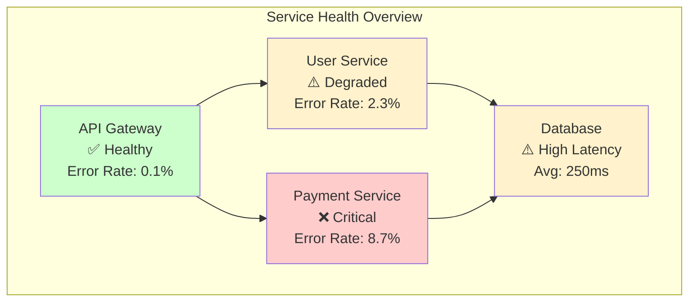
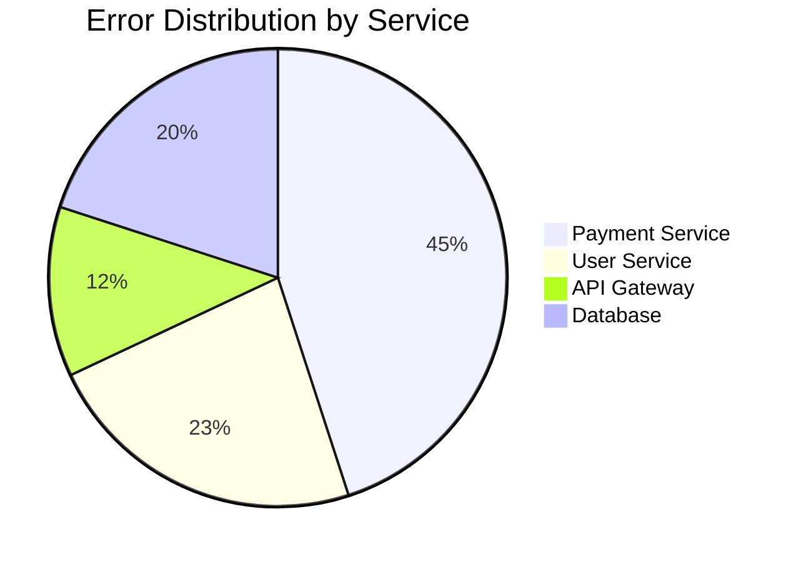
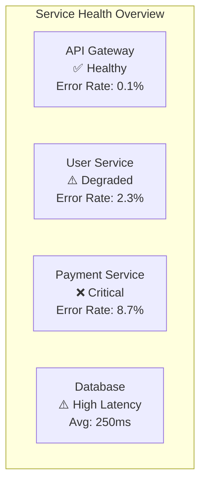
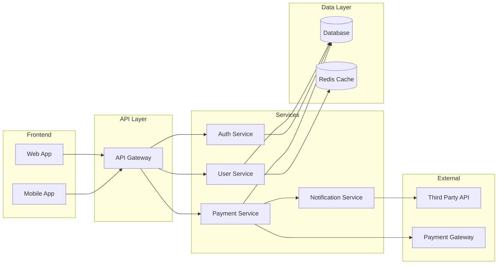

# Enhanced DocFX Reporting System

## Overview

The reporting system generates comprehensive, well-structured, and visually rich reports in DocFX-compatible markdown format. Reports are created in two main scenarios:

1. **Full Analysis Reports**: Generated by `loganalyzer report` command for completed analysis runs
2. **Interactive Session Reports**: Dynamically updated during `loganalyzer query` sessions

## DocFX Integration

### Metadata Structure
Every report includes comprehensive DocFX metadata for proper integration:

```yaml
---
title: Log Analysis Report - ProjectName
description: Comprehensive analysis report for project ProjectName
author: AI Log Analysis Tool
ms.date: 2024-01-15
ms.topic: analysis-report
ms.service: log-analysis
ms.custom:
  - project: ProjectName
  - analysis-run: RunID
  - log-count: 15000
  - analysis-duration: "00:05:23"
  - anomalies-found: 12
---
```

### Content Organization
Reports follow a structured format optimized for DocFX rendering and navigation:

#### Section Hierarchy
```markdown
# Executive Summary
## Key Findings
## Recommendations

# Analysis Overview
## Dataset Summary
## Analysis Parameters
## Processing Statistics

# Service Health Analysis
## Service Performance Metrics
## Error Rate Analysis
## Availability Assessment

# Anomaly Detection Results
## Critical Anomalies
## Performance Anomalies  
## Security Concerns
## Behavioral Anomalies

# Correlation Analysis
## Cross-Service Interactions
## Transaction Flow Analysis
## Dependency Mapping

# Detailed Findings
## Service-Specific Analysis
## Timeline Analysis
## Pattern Recognition

# Appendices
## Raw Data References
## Methodology Notes
## Configuration Details
```

## AI-Generated Mermaid Diagrams

### Dynamic Visualization Generation
The system uses specialized AI patterns to generate Mermaid diagrams based on analysis results:

#### Service Health Dashboard


#### Correlation Timeline

```mermaid
gantt
    title Transaction Flow Analysis
    dateFormat  HH:mm:ss
    axisFormat %H:%M:%S
    
    section API Gateway
    Request Received    :done, req1, 14:32:15, 14:32:16
    
    section User Service
    Authentication      :done, auth1, 14:32:16, 14:32:17
    
    section Payment Service
    Payment Processing  :crit, pay1, 14:32:17, 14:32:25
    Payment Failed      :crit, fail1, 14:32:25, 14:32:25
    
    section Database
    Query Timeout       :crit, db1, 14:32:20, 14:32:25
```


#### Error Distribution Chart


### Diagram Generation Implementation

#### AI Pattern for Diagram Creation
```csharp
public class DiagramGenerationService
{
    public async Task<string> GenerateServiceHealthDiagramAsync(
        List<ServiceHealthMetrics> metrics)
    {
        var pattern = await _patternLoader.LoadPatternAsync("generate_diagram");
        var context = BuildDiagramContext(metrics, "service-health");
        
        var response = await _openAiService.GenerateAsync(pattern, context);
        
        return ExtractMermaidDiagram(response);
    }
    
    public async Task<string> GenerateCorrelationTimelineAsync(
        List<CorrelationGroup> correlations)
    {
        var pattern = await _patternLoader.LoadPatternAsync("generate_diagram");
        var context = BuildDiagramContext(correlations, "correlation-timeline");
        
        var response = await _openAiService.GenerateAsync(pattern, context);
        
        return ExtractMermaidDiagram(response);
    }
}
```

## Data Validation and Transparency

### Raw Data Files
For transparency and validation, raw data tables are generated as separate markdown files linked to charts:

#### Data File Naming Convention
- `report_projectX_runY_chartZ_data.md`
- `report_WebAPI_20240615_ServiceHealth_data.md`
- `report_WebAPI_20240615_CorrelationAnalysis_data.md`

#### Raw Data Table Example
```markdown
---
title: Service Health Metrics - Raw Data
description: Raw data for service health analysis chart
parent: Log Analysis Report - WebAPI
ms.date: 2024-06-15
---

# Service Health Metrics - Raw Data

This file contains the raw data used to generate the Service Health Overview chart in the main analysis report.

## Data Collection Period
- **Start Time**: 2024-06-15 14:30:00 UTC
- **End Time**: 2024-06-15 15:30:00 UTC
- **Total Duration**: 1 hour

## Service Metrics

| Service Name | Total Requests | Error Count | Error Rate (%) | Avg Response Time (ms) | P95 Response Time (ms) |
|--------------|----------------|-------------|----------------|------------------------|------------------------|
| API Gateway | 10,247 | 12 | 0.12 | 45 | 120 |
| User Service | 8,456 | 194 | 2.29 | 89 | 245 |
| Payment Service | 3,421 | 298 | 8.71 | 156 | 890 |
| Database Service | 12,103 | 67 | 0.55 | 234 | 567 |

## Error Breakdown by Type

| Service Name | Timeout Errors | Connection Errors | Validation Errors | Other Errors |
|--------------|----------------|-------------------|-------------------|--------------|
| API Gateway | 3 | 2 | 5 | 2 |
| User Service | 45 | 23 | 89 | 37 |
| Payment Service | 156 | 78 | 34 | 30 |
| Database Service | 34 | 12 | 8 | 13 |

*This data was collected from log analysis run `20240615-143000` and processed using AI-powered anomaly detection patterns.*
```

### Data Linkage and Cross-References
Main reports include clear references to supporting data files:

```markdown
## Service Health Analysis

The following chart shows the overall health status of all services during the analysis period.



📊 **Raw Data**: [Service Health Metrics](./report_WebAPI_20240615_ServiceHealth_data.md)
```

## Interactive Session Reporting

### Real-Time Report Updates
During interactive query sessions, the report is continuously updated:

```csharp
public class InteractiveReportGenerator
{
    private readonly StringBuilder _reportContent;
    private int _queryCounter = 0;
    
    public async Task AppendQueryResultAsync(string query, QueryResult result)
    {
        _queryCounter++;
        
        var section = new StringBuilder();
        section.AppendLine($"## Query {_queryCounter}: {query}");
        section.AppendLine();
        
        // Add result summary
        section.AppendLine("### Results");
        section.AppendLine(FormatResultSummary(result));
        section.AppendLine();
        
        // Add charts if applicable
        if (result.SupportsVisualization)
        {
            var chart = await GenerateVisualizationAsync(result);
            section.AppendLine("### Visualization");
            section.AppendLine("```mermaid");
            section.AppendLine(chart);
            section.AppendLine("```");
            section.AppendLine();
        }
        
        // Add data table
        section.AppendLine("### Data");
        section.AppendLine(FormatDataTable(result));
        section.AppendLine();
        
        _reportContent.Append(section.ToString());
        
        // Save updated report
        await SaveReportAsync();
    }
}
```

### Session Report Finalization
When the interactive session ends, the report is finalized with:

- **Session Summary**: Overview of all queries and findings
- **Key Insights**: AI-generated summary of important discoveries
- **Follow-up Recommendations**: Suggested next steps based on query results
- **Export Options**: Links to detailed data exports

## Advanced Visualizations

### Trend Analysis Charts
```mermaid
xychart-beta
    title "Error Rate Trends Over Time"
    x-axis [14:00, 14:15, 14:30, 14:45, 15:00, 15:15, 15:30]
    y-axis "Error Rate (%)" 0 --> 10
    line [0.5, 1.2, 2.1, 4.5, 8.2, 6.1, 3.8]
```

### Service Dependency Maps


## Report Customization and Theming

### DocFX Theme Integration
Reports are designed to integrate seamlessly with DocFX themes:

- **Responsive Design**: Charts and tables adapt to different screen sizes
- **Accessibility**: Proper heading structure and alt text for visualizations
- **Navigation**: Automatic table of contents generation
- **Search Integration**: Optimized content for DocFX search functionality

### Custom Styling
```markdown
<style>
.anomaly-critical {
    background-color: #ffebee;
    border-left: 4px solid #f44336;
    padding: 10px;
    margin: 10px 0;
}

.service-healthy {
    color: #4caf50;
    font-weight: bold;
}

.service-degraded {
    color: #ff9800;
    font-weight: bold;
}

.service-critical {
    color: #f44336;
    font-weight: bold;
}
</style>
```
